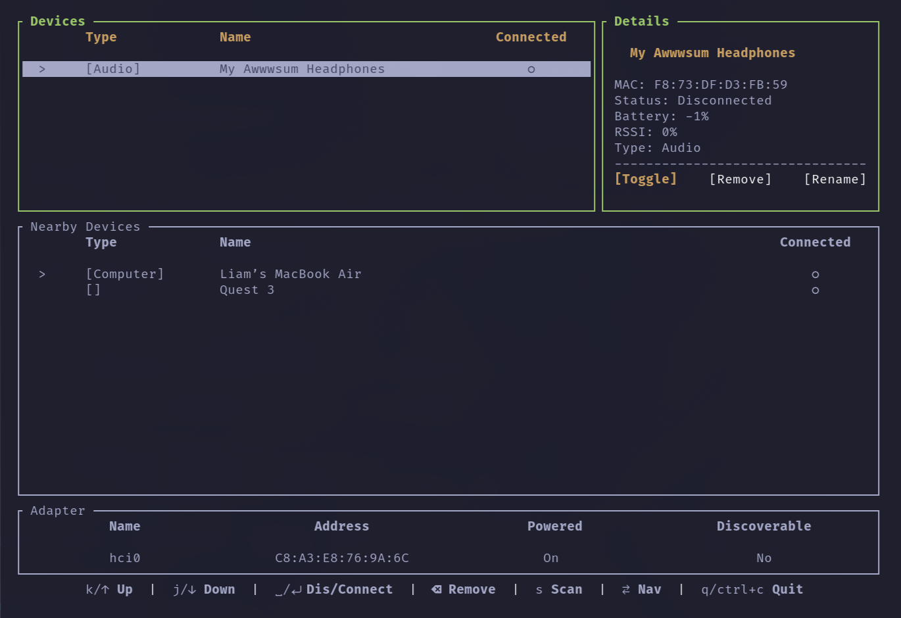

<div align="center">
  <h2> Bluepala (Impala but for Bluetooth, Go Edition) </h2>
</div>


A lightweight (hopefully) terminal-friendly BlueZ wrapper written in Go.
It’s a clone of Impala, because Impala’s UI made a single majestic white tear roll down my leg.

---

## 📸 Demo



---

## 💡 Prerequisites

A Linux-based OS with BlueZ and dbus running.

---

## 🚀 Installation

### Binary Release

Pre-built binaries coming soon.

---

### Install from AUR

```bash
# Using yay
yay -S bluepala

# Or using paru
paru -S bluepala
```

You'll need:

Go 1.25.1+ (only for building AUR package locally)
- BlueZ running
- dbus available

---

### Install from Source (Go)

```bash
git clone https://github.com/joel-sgc/bluepala.git
cd bluepala
go build
./bluepala
```

You'll need:

- Go 1.25.1+
- BlueZ running
- dbus available

---

### Omarchy / Waybar launcher example

```bash
#!/bin/bash
exec setsid uwsm-app -- xdg-terminal-exec --app-id=com.omarchy.Impala -e bluepala \"$@\"
```

---

## 🪄 Usage

### Global

- Tab / Shift+Tab : Switch between sections
- j / Down : Scroll down
- k / Up : Scroll up
- s : Force scan
- q / Ctrl+C: Quit

### Networks

- Space / Enter : Connect / Disconnect
- Delete / Backspace : Remove device

---

## 🚀 Features (So Far)

- List available Bluetooth adapters
- Show paired devices
- Show scanned/nearby devices (scan toggle)
- Connect/Disconnect to/from devices
- View advanced devices details
- Sort scanned devices by RSSI
- React to BlueZ D-Bus signals (device added/removed, properties changed)

---

## ⚠️ Missing / TODO

- Built-in BlueZ agent implementation to surface PIN / confirmation modals to the TUI
- Pairing/unpairing flows are supported via BlueZ but UI polish may be incomplete
- Connect/disconnect flows rely on BlueZ signals — some edge cases may need refinement
- Better handling for LE vs BR/EDR-specific device details
- PIN pairing modals are not integrated yet
- Renaming is not integrated yet

---

## 🧩 Implementation Notes

The DBus code was mostly vibe-coded.
It works. I don’t care. If you do care, fork it and figure it out.

---

## 🧾 License

Do What the Fuck You Want To Public License (WTFPL)

---

## ❤️ Closing Thoughts

I built this for myself because I wanted something that just works, and this just works.
If you like it, awesome. If not, feel free to improve it or ignore it entirely.

Oh- also check out my Wi-Fi manager [**Netpala**](https://github.com/joel-sgc/netpala), which works beautifully with NetworkManager and 802.1X networks!